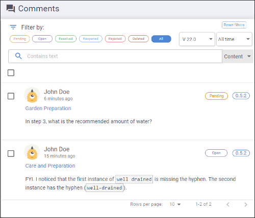
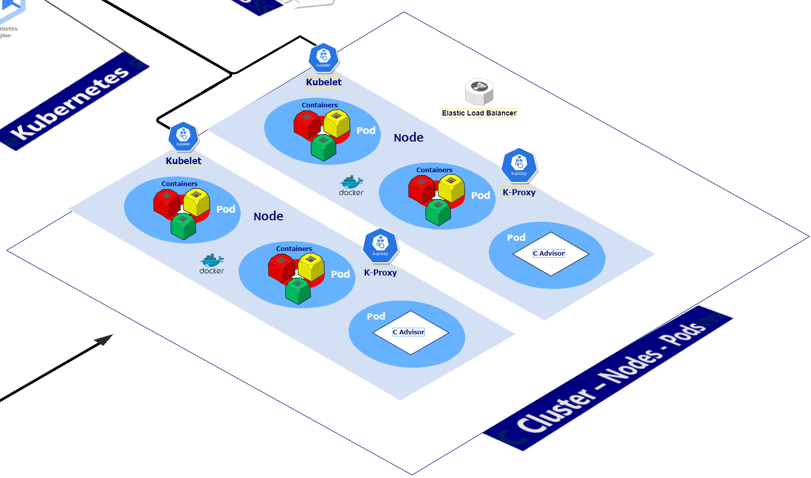

- [Cluster Creation](#cluster-creation)
  - [Cluster Creation Considerations in CDWM](#cluster-creation-considerations-in-cdwm)
  - [Factors to consider when creating clusters in cloud-based applications](#factors-to-consider-when-creating-clusters-in-cloud-based-applications)


# Cluster Creation    

## Cluster Creation Considerations in CDWM

**Task Purpose**: Familiarize users with steps required to create clusters and the impacts of cloud environments on cluster creation. 

**Anticipated Time**: 15 - 20 Minutes + Time required to acquire resources by Cloud Provider.

**Cloud Providers**: Private and Major Public Clouds or Both - This example (**AWS**)


**Content**

1. Factors to consider when creating clusters in cloud-based applications
2. Create your first cluster from available hardware choices
3. Steps to take when cluster creation fails
4. Assign appropriate user privileges to a cluster
5. Execute a query with the created cluster

Level: Beginner -- **Intermediate **❎  -- Advanced

**Software Version**: Yellowbrick Cloud Data Warehouse Manager (CDWM) v6.0
<br><br>




## Factors to consider when creating clusters in cloud-based applications

In its simplest form, a cluster can be two connected computers running as one individual system. In this very simple scenario, each computer is acting as a node. In Kubernetes, which is utilized by Yellowbrick Cloud Data Warehouse, a cluster is one or more nodes managed by Kubernetes. The composition of nodes can be physical servers, virtual machines (cloud and on premises), with each node having a container runtime (Docker). There are several key components of note, including Kubelet, which manages containers based on requests from the Kubernetes Control Plane. Also, Kube-Proxy which manages Kubernetes load-balancing and networking.
<br><br>



There are more options for creating clusters on-premises than in the cloud. In the cloud users often have choices of pre-configured clusters which they can increase or decrease in size. This takes the form of increasing or decreasing the number of nodes, which in-turn influences both the performance and reliability of a cluster. That said, simply having more nodes will not guarantee better performance but it will provide greater resource availability. It is a given that nodes fail, but the more nodes available, the less disruptive node failures will be. This is due to cluster availability not being affected as the cluster is not starved of resources during a node failure. This is also where the composition of cluster nodes plays an important role as touched upon earlier.

**Physical Vs Virtual Machines**

Nodes mostly composed of virtual machines are riskier than nodes composed of physical servers. If you have 20 virtual machine nodes running on four physical servers in the cloud, one physical server failure reduces your node availability by 25%, two failures increase it by 50% and so on. You can imagine the impact this will have on your cluster. Therefore, the right mix of physical and virtual machines is essential. The more mission critical the requirement the more important this mix becomes, it's also important to be on a fast low-latency network. When using cloud-based systems, you have little say in how efficient your cloud vendors network will be. In essence, the right mix ensures avoidance of too few nodes (which impacts availability), or too many nodes which are more complex for Kubernetes to manage. This can sometimes be called a Pod Disruption budget (PDB), whereby a PDB maintains a pre-arranged number of pods sufficient to provide acceptable service levels.

Another key component involved in the smooth running of Kubernetes clusters is the Scheduler. The scheduler in Kubernetes is responsible for choosing nodes to run containers. This process is run by the Kubernetes Control plane which is run by a master node. A cluster can tolerate the loss of worker nodes more easily than master nodes for this reason (among others). If the master node(s) are lost the Control Plane and key processes can fail thus affecting your cluster availability. The situation is exacerbated where there is only one master node.

```sql
SELECT vodviewers1302."show", season, country_name, highest_ranking, region, continent, "source"
FROM vodviewers1302  INNER JOIN highest_rankings ON vodviewers1302.show = highest_rankings.show
WHERE  (vodviewers1302.source = N'Twitter Followers');
```
- [ ] bbbhbhbhhhhhhhhhhhh
- [ ] aaaaaaaaaaaaaaaaaaaaaa
- [ ] cccccccccccccccccccccc
<!-- > ghhhvhjvjhhhhhhhh -->

---
hhhhhh